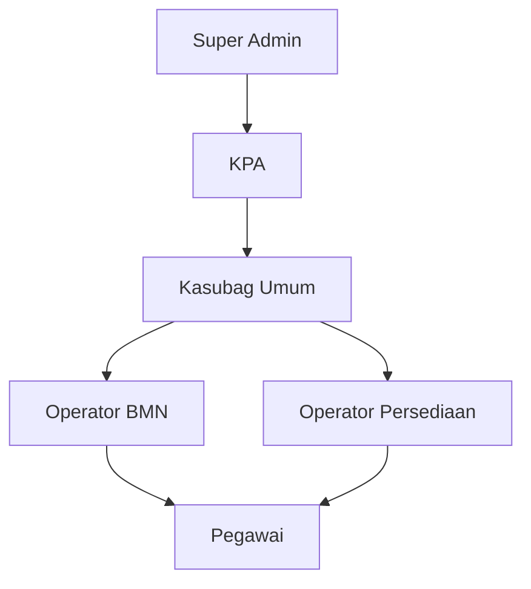

# PRD: Aplikasi Manajemen Aset dan Persediaan
## Pengadilan Agama Penajam Paser Utara Kelas II

---

## 1. Executive Summary

Aplikasi Manajemen Aset dan Persediaan adalah sistem informasi berbasis web (PWA-ready) yang dirancang untuk mendukung Sub Bagian Umum dalam:

1. **Pendataan & Monitoring Aset** - Master data BMN untuk kemudahan pelaporan ke SAKTI & SIMAN
2. **Manajemen Persediaan ATK** - Workflow lengkap dengan stock opname dan pelaporan
3. **Manajemen Bahan Keperluan Kantor** - Pencatatan sederhana kebutuhan operasional

> [!IMPORTANT]
> Aplikasi ini bersifat **supporting system** untuk mempersiapkan data sebelum input ke sistem Kemenkeu (SAKTI & SIMAN), bukan sebagai pengganti sistem tersebut.

---

## 2. Latar Belakang & Tujuan

### Latar Belakang

| Sistem Kemenkeu | Yang Diakomodir | Yang Tidak Diakomodir |
|-----------------|-----------------|----------------------|
| **SAKTI** | Pembayaran, pencatatan nominal | Manajemen operasional persediaan |
| **SIMAN** | Workflow aset, mutasi | - |

Gap yang ada: **Tidak ada sistem untuk mengelola workflow permintaan, distribusi, dan monitoring persediaan secara operasional.**

### Tujuan Aplikasi

1. Menyediakan master data aset yang terstruktur sesuai standar KPKNL/Kemenkeu
2. Mengelola siklus hidup persediaan ATK dari pengadaan hingga pemakaian
3. Mempercepat proses permintaan barang dengan workflow approval digital
4. Memudahkan stock opname dan pelaporan persediaan
5. Menyediakan data siap-export untuk input ke SAKTI/SIMAN

---

## 3. Scope & Batasan

### Dalam Scope

| Item | Keterangan |
|------|------------|
| Pendataan aset BMN | CRUD, monitoring, export |
| Manajemen persediaan ATK | Full workflow + opname |
| Bahan keperluan kantor | Pencatatan sederhana |
| Notifikasi WhatsApp | Via Fonnte API |
| PWA Support | Installable, camera access |

### Di Luar Scope

| Item | Alasan |
|------|--------|
| Integrasi langsung SAKTI/SIMAN | Sistem closed milik Kemenkeu |
| Workflow approval aset | Sudah ada di SIMAN |
| Manajemen anggaran/pagu | Sudah ada di SAKTI |
| Pembayaran/pencairan | Sudah ada di SAKTI |

---

## 4. User Roles & Personas

### Role Hierarchy



### Detail Role & Permission

| Role | Akses Aset | Akses ATK | Akses Bahan Kantor | Approval |
|------|------------|-----------|-------------------|----------|
| **Super Admin** | Full CRUD + Config | Full CRUD + Config | Full CRUD + Config | - |
| **KPA** | View + Report | View + Report | View + Report | Level 3 (Final) |
| **Kasubag Umum** | View + Report | View + Report | Full CRUD | Level 2 |
| **Operator BMN** | Full CRUD | View | View | - |
| **Operator Persediaan** | View | Full CRUD | Full CRUD | Level 1 |
| **Pegawai** | View | Request Only | Request Only | - |

---

## 5. Modul Aset (BMN)

> [!NOTE]
> Modul ini bersifat **master data & monitoring** tanpa workflow approval (workflow ada di SIMAN).

### 5.1 Fitur Utama

| Fitur | Deskripsi |
|-------|-----------|
| **Pendataan Aset** | Input data aset sesuai format SIMAK BMN |
| **Klasifikasi** | Kode akun 14 digit sesuai standar Kemenkeu |
| **Lokasi & PJ** | Tracking ruangan dan penanggung jawab |
| **Update Kondisi** | Status: Baik (B), Rusak Ringan (RR), Rusak Berat (RB) |
| **Dokumentasi** | Upload foto aset dan dokumen pendukung |
| **Pencarian** | Filter berdasarkan kode akun, lokasi, kondisi, tahun perolehan |
| **Export** | Format Excel sesuai template SAKTI/SIMAN |

### 5.2 Data Model Aset

| Field | Tipe | Keterangan |
|-------|------|------------|
| `kode_akun` | VARCHAR(14) | Kode akun Kemenkeu |
| `nup` | INTEGER | Nomor Urut Pendaftaran |
| `nama_barang` | VARCHAR(255) | Nama/deskripsi aset |
| `merk_type` | VARCHAR(100) | Merk dan tipe |
| `tahun_perolehan` | YEAR | Tahun pengadaan |
| `nilai_perolehan` | DECIMAL | Harga perolehan |
| `nilai_buku` | DECIMAL | Setelah penyusutan |
| `kondisi` | ENUM | B / RR / RB |
| `lokasi_id` | FK | Referensi ke ruangan |
| `pj_id` | FK | Penanggung jawab |
| `foto_url` | VARCHAR(255) | Path foto aset |
| `dokumen_url` | VARCHAR(255) | Path dokumen pendukung |
| `keterangan` | TEXT | Catatan tambahan |

### 5.3 Laporan Aset (Export-Ready)

| Laporan | Format | Kegunaan |
|---------|--------|----------|
| Daftar BMN per Akun | Excel | Referensi input SAKTI |
| KIB A-F | PDF | Kartu Inventaris Barang |
| Daftar Barang Ruangan (DBR) | PDF | Per ruangan |
| Rekap Kondisi Aset | Excel/PDF | Monitoring kondisi |

### 5.4 Monitoring Perawatan Aset

| Fitur | Deskripsi |
|-------|-----------|
| **Jadwal Pemeliharaan** | Atur jadwal perawatan berkala per aset (harian/mingguan/bulanan/tahunan) |
| **Riwayat Perbaikan** | Catat setiap kegiatan perbaikan/servis aset |
| **Biaya Perawatan** | Tracking biaya pemeliharaan dan perbaikan |
| **Reminder Perawatan** | Notifikasi jadwal perawatan yang akan jatuh tempo |
| **Status Perawatan** | Terjadwal / Dalam Proses / Selesai |
| **Dokumentasi** | Upload foto sebelum-sesudah perbaikan |

**Data Model Perawatan:**

**Tabel: `asset_maintenances` (Jadwal & Riwayat Perawatan)**

| Field | Tipe | Keterangan |
|-------|------|------------|
| `id` | ULID | Primary key |
| `asset_id` | FK | Referensi ke aset |
| `jenis_perawatan` | ENUM | RUTIN / PERBAIKAN / SERVIS |
| `deskripsi` | TEXT | Detail kegiatan |
| `tanggal_jadwal` | DATE | Tanggal rencana |
| `tanggal_pelaksanaan` | DATE | Tanggal aktual |
| `biaya` | DECIMAL | Biaya perawatan |
| `vendor` | VARCHAR(100) | Penyedia jasa (jika ada) |
| `status` | ENUM | SCHEDULED / IN_PROGRESS / COMPLETED |
| `foto_sebelum` | VARCHAR(255) | Path foto sebelum |
| `foto_sesudah` | VARCHAR(255) | Path foto sesudah |
| `catatan` | TEXT | Catatan hasil |
| `created_by` | FK | User yang input |

**Tabel: `maintenance_schedules` (Template Jadwal Berkala)**

| Field | Tipe | Keterangan |
|-------|------|------------|
| `id` | ULID | Primary key |
| `asset_id` | FK | Referensi ke aset |
| `nama_perawatan` | VARCHAR(100) | Nama kegiatan rutin |
| `interval` | ENUM | DAILY / WEEKLY / MONTHLY / QUARTERLY / YEARLY |
| `hari_reminder` | INTEGER | H-berapa reminder dikirim |
| `is_active` | BOOLEAN | Status aktif/nonaktif |

---

## 6. Modul Persediaan ATK

> [!IMPORTANT]
> Modul ini adalah **fitur utama** dengan workflow approval lengkap dan stock opname.

### 6.1 Workflow Persediaan ATK

```mermaid
flowchart LR
    subgraph Pengadaan
        A1[Input Pembelian] --> A2[Terima Barang]
        A2 --> A3[Update Stok]
    end
    
    subgraph Permintaan
        B1[Pegawai Request] --> B2[Operator Verifikasi]
        B2 --> B3[Kasubag Approve]
        B3 --> B4[KPA Approve Final]
        B4 --> B5[Distribusi]
        B5 --> B6[Konfirmasi Terima]
    end
    
    subgraph Opname
        C1[Jadwal Opname] --> C2[Hitung Fisik]
        C2 --> C3[Rekonsiliasi]
        C3 --> C4[Berita Acara]
    end
    
    A3 --> B1
    B6 --> C1
```



### 6.2 Flow Approval 3-Level

| Level | Approver | Kondisi Lanjut | Aksi |
|-------|----------|----------------|------|
| **Level 1** | Operator Persediaan | Stok tersedia | Verifikasi ketersediaan, forward ke L2 |
| **Level 2** | Kasubag Umum | Kebutuhan valid | Approval administratif, forward ke L3 |
| **Level 3** | KPA | Sesuai kebutuhan | Final approval, trigger distribusi |

**Status Permintaan:**
- `DRAFT` → `PENDING_L1` → `PENDING_L2` → `PENDING_L3` → `APPROVED` → `DISTRIBUTED` → `COMPLETED`
- Atau: `REJECTED` (di level manapun)

### 6.3 Fitur Detail ATK

| Kategori | Fitur | Deskripsi |
|----------|-------|-----------|
| **Pengadaan** | Input Pembelian | Catat pembelian baru + BAST |
| | Penerimaan Barang | Verifikasi fisik vs dokumen |
| **Stok** | Kartu Stok Digital | Real-time stock card per item |
| | Reorder Point | Alert saat stok ≤ minimum |
| | Stok Opname | Hitung fisik periodik |
| **Permintaan** | Form Request | Pegawai ajukan kebutuhan |
| | Tracking Status | Lihat progress approval |
| | Riwayat | History permintaan per user |
| **Distribusi** | Bon Pengeluaran | Dokumen serah terima |
| | Tanda Terima Digital | Konfirmasi penerima |
| **Pelaporan** | Mutasi Stok | Masuk-keluar per periode |
| | Rekap Pemakaian | Per unit/pegawai |
| | Berita Acara Opname | Hasil stock opname |

### 6.4 Data Model ATK

**Tabel: `atk_items` (Master Barang)**

| Field | Tipe | Keterangan |
|-------|------|------------|
| `id` | ULID | Primary key |
| `kode_barang` | VARCHAR(20) | Kode internal |
| `nama_barang` | VARCHAR(255) | Nama ATK |
| `satuan` | VARCHAR(20) | Unit (pcs, rim, box, dll) |
| `kategori` | VARCHAR(50) | Kategori ATK |
| `stok_minimum` | INTEGER | Reorder point |
| `stok_aktual` | INTEGER | Stok saat ini |
| `harga_satuan` | DECIMAL | Harga per unit |

**Tabel: `atk_transactions` (Mutasi)**

| Field | Tipe | Keterangan |
|-------|------|------------|
| `id` | ULID | Primary key |
| `item_id` | FK | Referensi barang |
| `tipe` | ENUM | IN / OUT |
| `jumlah` | INTEGER | Quantity |
| `saldo_akhir` | INTEGER | Saldo setelah transaksi |
| `referensi_id` | FK | ID pembelian atau permintaan |
| `tanggal` | DATE | Tanggal transaksi |

**Tabel: `atk_requests` (Permintaan)**

| Field | Tipe | Keterangan |
|-------|------|------------|
| `id` | ULID | Primary key |
| `nomor_request` | VARCHAR(20) | Auto-generated |
| `pemohon_id` | FK | User yang mengajukan |
| `unit_kerja` | VARCHAR(100) | Bagian/unit |
| `tanggal_request` | DATETIME | Waktu pengajuan |
| `status` | ENUM | Status approval |
| `catatan` | TEXT | Keterangan kebutuhan |

**Tabel: `atk_request_items` (Detail Permintaan)**

| Field | Tipe | Keterangan |
|-------|------|------------|
| `request_id` | FK | Referensi permintaan |
| `item_id` | FK | Barang yang diminta |
| `jumlah_diminta` | INTEGER | Qty request |
| `jumlah_disetujui` | INTEGER | Qty approved |

**Tabel: `atk_approvals` (Log Approval)**

| Field | Tipe | Keterangan |
|-------|------|------------|
| `id` | ULID | Primary key |
| `request_id` | FK | Referensi permintaan |
| `level` | INTEGER | 1 / 2 / 3 |
| `approver_id` | FK | User approver |
| `status` | ENUM | APPROVED / REJECTED |
| `catatan` | TEXT | Komentar approver |
| `tanggal` | DATETIME | Waktu approval |

**Tabel: `atk_opnames` (Stock Opname)**

| Field | Tipe | Keterangan |
|-------|------|------------|
| `id` | ULID | Primary key |
| `tanggal` | DATE | Tanggal opname |
| `periode` | VARCHAR(20) | Contoh: "2026-Q1" |
| `petugas_id` | FK | Yang melakukan opname |
| `status` | ENUM | DRAFT / COMPLETED |

**Tabel: `atk_opname_items` (Detail Opname)**

| Field | Tipe | Keterangan |
|-------|------|------------|
| `opname_id` | FK | Referensi opname |
| `item_id` | FK | Barang |
| `stok_sistem` | INTEGER | Stok di aplikasi |
| `stok_fisik` | INTEGER | Hasil hitung |
| `selisih` | INTEGER | Fisik - Sistem |
| `keterangan` | TEXT | Penjelasan selisih |

---

## 7. Modul Bahan Keperluan Kantor

> [!NOTE]
> Modul ini lebih sederhana, tanpa stock opname formal.

### 7.1 Fitur

| Fitur | Deskripsi |
|-------|-----------|
| Pencatatan Pembelian | Input pembelian bahan kantor |
| Pencatatan Pemakaian | Catat penggunaan |
| Permintaan Barang | Workflow sama seperti ATK (3-level) |
| Rekap Pengeluaran | Laporan pemakaian per periode |

### 7.2 Kategori Bahan Keperluan Kantor

- Bahan kebersihan (sabun, pengharum, dll)
- Konsumsi rapat
- Bahan cetakan
- Perlengkapan dapur
- Dan lain-lain sesuai kebutuhan

### 7.3 Data Model (Simplified)

Menggunakan struktur serupa dengan ATK tapi tanpa tabel opname:
- `bkk_items` - Master barang
- `bkk_transactions` - Mutasi masuk/keluar
- `bkk_requests` - Permintaan (share workflow approval dengan ATK)

---

## 8. Integrasi Notifikasi Fonnte

### 8.1 Konfigurasi

| Setting | Value |
|---------|-------|
| Provider | Fonnte.com |
| Authentication | Token-based |
| Config Location | `.env` → `FONNTE_TOKEN` |

### 8.2 Event Notification

| Event | Penerima | Template |
|-------|----------|----------|
| Request Baru | Operator Persediaan | `📦 Permintaan baru #{no} dari {nama} untuk {n} item. Silakan verifikasi.` |
| Pending Approval L2 | Kasubag Umum | `✅ Permintaan #{no} sudah diverifikasi Operator. Menunggu approval Anda.` |
| Pending Approval L3 | KPA | `✅ Permintaan #{no} sudah diapprove Kasubag. Menunggu approval final.` |
| Approved | Pemohon | `🎉 Permintaan Anda #{no} telah DISETUJUI. Silakan ambil barang di Sub Bagian Umum.` |
| Rejected | Pemohon | `❌ Permintaan Anda #{no} DITOLAK. Alasan: {alasan}` |
| Stok Menipis | Operator Persediaan | `⚠️ Stok {nama_barang} tersisa {qty} {satuan}. Segera lakukan pengadaan!` |
| Reminder Opname | Operator Persediaan | `📋 Reminder: Jadwal stock opname periode {periode} pada {tanggal}` |
| Reminder Perawatan Aset | Operator BMN | `🔧 Reminder: Jadwal perawatan {nama_aset} pada {tanggal}. Jenis: {jenis_perawatan}` |

### 8.3 Implementation

```php
// app/Services/FonnteService.php
class FonnteService
{
    public function send(string $phone, string $message): bool
    {
        // POST to Fonnte API with token
    }
}
```

---

## 9. Non-Functional Requirements

### 9.1 PWA Requirements

| Feature | Keterangan |
|---------|------------|
| Installable | Add to home screen di Android/iOS |
| Offline View | Cache data yang sudah dibuka |
| Camera Access | Untuk scan barcode & foto aset |
| Push Notification | Via service worker (optional, Fonnte utama) |

### 9.2 Security

| Aspek | Implementasi |
|-------|--------------|
| Authentication | Laravel Fortify (session-based) |
| Authorization | Spatie Permission (role-based) |
| CSRF Protection | Laravel built-in |
| XSS Prevention | Content Security Policy |
| Input Validation | Form Request classes |

### 9.3 Performance

| Metrik | Target |
|--------|--------|
| Page Load | < 3 detik |
| API Response | < 500ms |
| Concurrent Users | 20 users |

### 9.4 Backup & Recovery

| Aspek | Implementasi |
|-------|--------------|
| Database Backup | Daily automated backup |
| Export Feature | Admin dapat export seluruh data |

---

## 10. Tech Stack

| Layer | Teknologi | Versi |
|-------|-----------|-------|
| **Backend** | Laravel | 12 |
| **Frontend** | React + Inertia.js | v19 / v2 |
| **Styling** | TailwindCSS | v4 |
| **Database** | MySQL | 8.x |
| **PWA** | Vite PWA Plugin | Latest |
| **Auth** | Laravel Fortify | v1 |
| **Permission** | Spatie Laravel Permission | Latest |
| **Testing** | Pest | v4 |

---

## 11. Sitemap & Navigation

```
📁 Dashboard
├── 📊 Overview (statistik ringkas)
│
├── 📦 Aset (BMN)
│   ├── Daftar Aset
│   ├── Tambah Aset
│   ├── Lokasi & Ruangan
│   ├── Perawatan Aset
│   │   ├── Jadwal Pemeliharaan
│   │   ├── Riwayat Perbaikan
│   │   └── Biaya Perawatan
│   └── Laporan Aset
│
├── 🗂️ Persediaan ATK
│   ├── Master Barang ATK
│   ├── Stok & Kartu Stok
│   ├── Pengadaan/Pembelian
│   ├── Permintaan Barang
│   ├── Approval (per role)
│   ├── Stock Opname
│   └── Laporan ATK
│
├── 🧹 Bahan Keperluan Kantor
│   ├── Master Barang
│   ├── Pembelian
│   ├── Permintaan
│   └── Rekap Pengeluaran
│
├── 👥 Manajemen User
│   ├── Daftar User
│   ├── Role & Permission
│   └── Log Aktivitas
│
└── ⚙️ Pengaturan
    ├── Profil Satker
    ├── Konfigurasi Fonnte
    ├── Master Lokasi/Ruangan
    └── Backup Data
```

---

## 12. Verification Plan

Karena ini adalah **dokumen PRD** (bukan implementasi code), verifikasi dilakukan melalui:

### User Review
- Review kesesuaian dengan kebutuhan operasional Sub Bagian Umum
- Konfirmasi workflow approval sudah sesuai SOP internal
- Validasi data model mencakup semua field yang diperlukan

---

## Appendix A: Referensi Kode Akun BMN

Aplikasi akan menggunakan struktur kode akun 14 digit sesuai standar Kemenkeu:

```
X.XX.XX.XX.XXX.XXX
│ │  │  │  │   └── Sub-sub Kelompok
│ │  │  │  └────── Sub Kelompok
│ │  │  └───────── Kelompok
│ │  └──────────── Bidang
│ └─────────────── Golongan
└───────────────── Digit Kontrol
```

## Appendix B: Contoh Nomor Permintaan

Format: `ATK-YYYY-MM-XXXX`

Contoh: `ATK-2026-01-0001`

---

> [!TIP]
> Dokumen ini siap untuk direview. Silakan berikan masukan jika ada yang perlu ditambahkan atau diubah.
